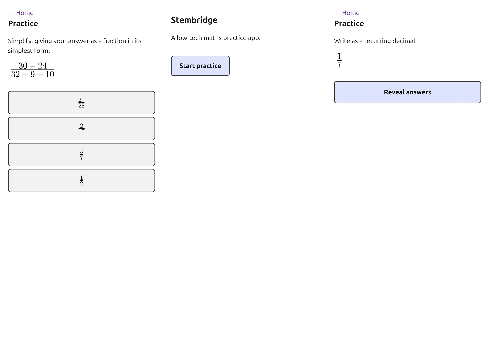

# Stembridge



A **low-tech maths practice app**. It has to work in rural settings on old
phones, so the web side is deliberately plain: hand-written HTML, CSS and
old-school JavaScript, **no frameworks, no build step, no CDN, no runtime
libraries**. All maths is pre-rendered to SVG images, so the browser never needs
a maths font or a formula library.

It is a simple static website, but it is meant to be **hosted** (any static
file server will do). Opening the files directly via `file://` is not supported:
the start page loads `data/index.json` over HTTP, and browsers don't reliably
share saved progress between local files.

To try it locally:

```sh
cd web
python3 -m http.server
```

```
stembridge/
├── web/                     the app (static files, serve as-is)
│   ├── index.html           landing page (redirects to start.html once the student has practised)
│   ├── start.html           start page for returning students, with per-topic progress
│   ├── practice.html        the practice flow
│   └── data/                generated — see cms/
│       ├── exercises.js     window.EXERCISES = [...]   ← loaded by practice.html
│       ├── index.json       manifest (generators, counts, timestamp) ← loaded by start.html
│       └── <slug>.json      one file per generator, for inspection
└── cms/                     content tooling (Python, managed with uv)
    ├── pyproject.toml
    └── generators/
        ├── run.py           runs every generator, writes web/data/
        ├── _lib.py          shared helpers (maths → SVG, exercise assembly)
        └── math/
            ├── 000_recurring_decimals.py
            ├── 001_bodmas.py
            └── 003_simplify_fraction.py
```

## Generating the exercises

Prerequisite: [uv](https://docs.astral.sh/uv/). Everything else (Python 3.13,
matplotlib) is installed automatically into `cms/.venv` on first run.

```sh
cd cms
uv run generators/run.py
```

This runs all generators and rewrites `web/data/`. Output is **deterministic** –
each generator is seeded from its own slug, so re-running produces identical
files (clean diffs). Commit `web/data/` alongside the code; the app is fully
static and needs no server-side step.

Run a single generator on its own for a quick look:

```sh
cd cms
uv run generators/math/001_bodmas.py
```

## How the web app works

`web/practice.html` is ~100 lines of vanilla JS. It loads
`web/data/exercises.js` with a plain `<script>` tag, then:

1. Pick a random exercise. Show its task line and the prompt image.
2. **Reveal answers** → show the 4 options as buttons, in random order.
3. Click a wrong option → that button is disabled (greyed + red). Keep trying.
4. Click the correct option → it turns green, and after 0.5 s the next random
   exercise loads.

### Progress

When an exercise is answered correctly, its id is saved in `localStorage`
under the key `solved` (`{"bodmas-03": 1, …}`). There are no accounts – progress
lives in the student's browser only.

`web/index.html` is the landing page for new visitors. As soon as `solved`
exists, it redirects to `web/start.html`, which loads `data/index.json` and
shows one bar per topic: the share
of that topic's exercises solved at least once. This is deliberately
simple and a placeholder for a better learning model later.

## Data format

`exercises.js` assigns an array to `window.EXERCISES`. Each item:

```js
{
  "id": "bodmas-03",                 // "<slug>-<NN>"
  "gen": "bodmas",
  "task": "Find the value of:",      // plain text instruction
  "prompt": "data:image/svg+xml;base64,…",   // the question, as an  src
  "options": [
    { "img": "data:image/svg+xml;base64,…", "correct": true  },
    { "img": "data:image/svg+xml;base64,…", "correct": false },
    { "img": "data:image/svg+xml;base64,…", "correct": false },
    { "img": "data:image/svg+xml;base64,…", "correct": false }
  ]
}
```

Always exactly 4 options: 1 correct + 3 distractors. Order in the file is not
meaningful – the app shuffles. Images are standalone SVGs (glyphs embedded as
paths, transparent background) inlined as `data:` URIs, so a page needs nothing
but the one `.js` file. Scale them with CSS `height`.

## Adding a generator

1. Create `cms/generators/<subject>/<NNN>_<name>.py` (the `math/` folder is the
   only subject so far; a new folder is picked up automatically).
2. Give it three names:

   ```python
   import pathlib, sys
   sys.path.insert(0, str(pathlib.Path(__file__).resolve().parents[1]))
   from _lib import build_exercise, run_standalone

   SLUG = "my_topic"
   TITLE = "My topic"

   def build(rng):                     # rng is a seeded random.Random
       out = []
       for i in range(10):
           out.append(build_exercise(
               SLUG, i,
               "Do the thing:",         # task text
               r"\frac{1}{2} + \frac{1}{3}",   # prompt, TeX maths
               r"\frac{5}{6}",                 # correct answer, TeX maths
               [r"\frac{2}{5}", r"\frac{1}{6}", r"\frac{2}{6}"],  # 3 distractors
           ))
       return out

   if __name__ == "__main__":
       run_standalone(globals())
   ```

3. `uv run generators/run.py`.

Rules of the house:

- `build(rng)` returns **10** exercises, each with **3** distractors.
- Distractors must be plausible wrong answers, distinct from each other and from
  the correct one (a common choice: correct answers of sibling exercises, or the
  values you get from a typical mistake).
- Maths goes through `build_exercise` as TeX strings; `_lib.render_math` turns
  them into SVG using matplotlib's built-in mathtext (no system LaTeX needed).
  `\frac`, `\overline`, `\times`, `\div`, `\left( \right)` all work.
- Use the passed `rng` for every random choice so output stays reproducible.

## The three current generators

| Slug | Task | Notes |
|------|------|-------|
| `recurring_decimals` | Write a fraction as a recurring decimal | mixed numbers, denominators 3/6/7/9/11; distractors are other fractions' decimals |
| `bodmas` | Evaluate an expression following BODMAS | random expression tree, exact division only, result 0–50; distractors come from breaking operator precedence |
| `simplify_fraction` | Simplify to a fraction in lowest terms | 1–3 numbers per part joined with ± , composites preferred; distractors are random reduced fractions |

## Design constraints (don't regress these)

- No external requests from `web/` – no CDN, no web fonts, no analytics.
- No JS libraries or bundler; keep `practice.html` readable in one screen.
- Works from any plain static host – no server-side code.
- Keep `exercises.js` small; pre-rendered SVG paths are the bulk of it.
